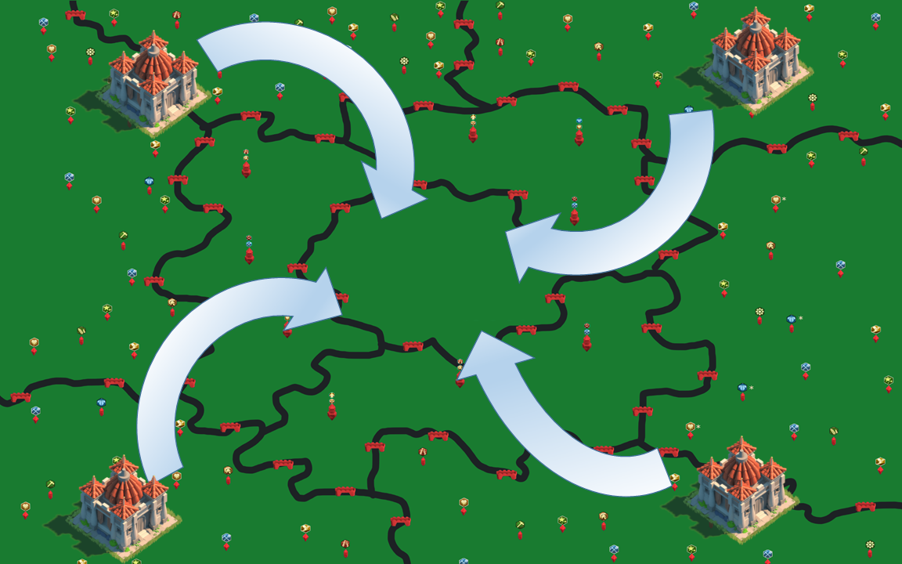
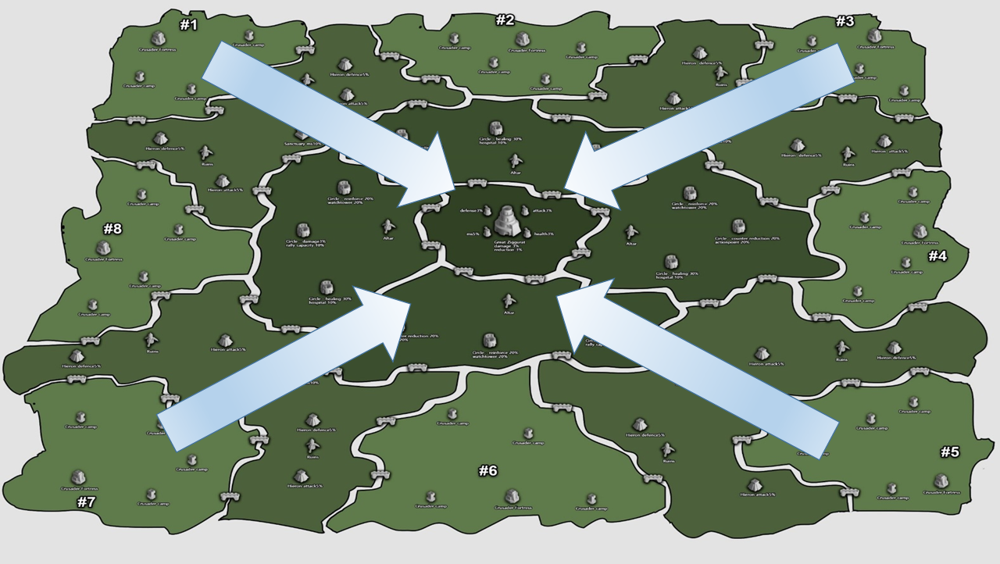

# 1. Rise Of Kingdoms 개요

## 개요

* 유저는  게임을 시작하면 한 왕국에 위치하게 됩니다. 
* 이 게임의 1차 목표는 왕국의 가운데에 위치한 잃어버린 신전을 점령하고 왕국의 지배자가 되는것 입니다. 이를 위해 게이머는 연맹을 구성하고 힘을 합쳐 국왕연맹이 되기 위해 노력합니다.
* 왕국 내의 상황과 관계 없이 일정 시간이 지나면 서버 대항전이 열리게 됩니다. 이를 두고 라오킹 게이머들은 Kingdom vs Kingdom 의 약자를 따 KVK라고 부릅니다.
* 대부분의 게이머들은 이를 알기에 KVK가 열리기 전에 왕국을 통합하고 KVK를 대비하게 됩니다.

## Kingdom vs Kingdom

* KVK는 비슷한 시기에 시작하게된 8개의 왕국이 모여 다시 지도의 가운데에 위치한 거대 지구라트를 점령하기 위해 싸우게 됩니다.
* 이 KVK가 끝나는 시점에 거대 지구라트를 점령하고 있는 왕국, 연맹은 막대한 보상을 받게 됩니다. 
* 이 목표를 이루기 위해서는 왕국과 연맹의 유저들이 같은 목표로 단합해야 하고 왕국에서는 이를 위해 좋은 활약을 보인 유저를 객관적인 지표로 확인해야 할 필요가 있게 되었습니다.

## 유저 활약도 수집 필요

* 여러가지 기준이 있을 수 있지만 대개는 전투에 얼마나 참여하고 실적을 냈는지를 많이 보게 됩니다
* 하지만 게임 내에서 이런 실적을 확인하기 위한 페이지가 부족하여 연맹과 왕국의 관리지가 수동으로 데이터를 수집하여 통계를 내게 됩니다. 이를 위해 활약도 수집기를 제작하게 되었습니다.

