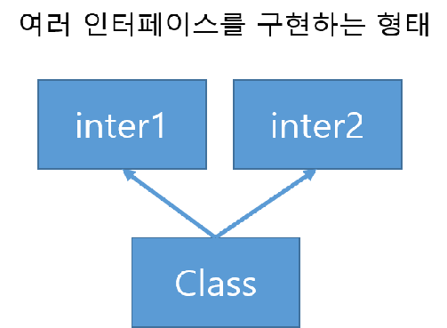

# 13. 인터페이스

자식 클래스에게 구현을 모두 맡기는 구조다. 추상 클래스와 다르게 메서드가 모두 추상 클래스이고  멤버변수는 static final 한 값-&gt; 상수만이 올 수 있다.

1. 부모 인터페이스에 모든 메서드가 있어 구현을 클래스에 강제 하는 형태 

   2. 클래스가 다중 인터페이스를 상속받아 필요에 따라 역할을 바꾸는 형태 

   

