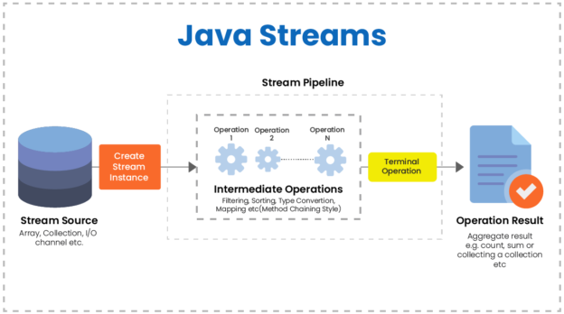

# 01.Java Stream

[소스 링크](../../../)



1.8 버전부터 나오기 시작한 개념. 람다식을 많이 이용한다.

스트림은 일회성이다.

자세한 내용은 필요 할때 스트림이 있다라는 정도만 알고 넘어가자

### 장점

1. 소스의 라인이 줄고 간단해진다. 
2. 범용성이 늘어난다

```java
		ArrayList<String> arr = new ArrayList<String>(
				Arrays.asList("one","two","three","four","five"));
						
		// 향상된 for문
		for(String a: arr) {
			System.out.println(a);
		}
		
		// 스트림을 사용한 출
		arr.stream().forEach(System.out::println);
```

### 단점

* 스트림에 익숙하지 않으면 오히려 가독성이 떨어진다.
* 반복문의 속도가 느린편
* 잘못 사용할 경우 익셉션이 발생할 수 있어 예외처리가 필요하다.

