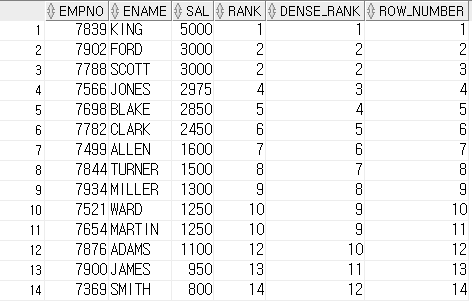

# 9. View

## View

실제 테이블의 부분집합으로 만든 가상 테이블

```text
CREATE [OR REPLACE] VIEW view_name
AS subquery
[WITH CHECK OPTION]
[WITH READ ONLY]
```

## Inline View

한 쿼리내에서만 유효한 View  FROM절에 있는 서브쿼리가 인라인 뷰이다.

## TOPN 구문

등수나 페이징 처리에 많이 사용하는 기법

* 함수를 이용한 방법 : 간단하나 로우가 많을떄 느리다. GROUP BY되어 있는 SELECT에서 또다른 순위를 낼때 편하다.

```text
SELECT EMPNO, ENAME, SAL, RANK() OVER(ORDER BY sal DESC) AS RANK,
       DENSE_RANK() OVER(ORDER BY sal DESC) AS DENSE_RANK,
       ROW_NUMBER() OVER(ORDER BY sal DESC) AS ROW_NUMBER
  FROM EMP;
  
// 함수를 이용한 등수 처리는 결과열이 적을때 사용하
```



* ROWNUM을 이용하는 방법 인덱스를 사용 할 수 있어 빠르지만 쿼리가 복잡해짐
* FIRST\_ROWS\(N\) 힌트를 사용하는 방법
* INDEX 정렬 힌트를 사용하는 방법

