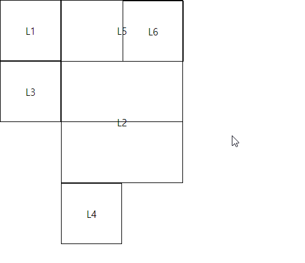

# 04.HTML\_CSS속성


### CSS 단위들: 글자 크기 em, %, px 

자세한 크기는 아래 링크 참조



```css
#content1 p:nth-child(1){font-size: 1em;}
#content1 p:nth-child(2){font-size:16px;}
#content1 p:nth-child(3){font-size:100%;}
```

### url\(\) : 백그라운드 이미지

```css
#content{
    width:80%; height:100%; margin:0 auto;
    background-image:url('sulhyun.jpg'); 
/* 원격지,인터넷 url도 가능*/
}

```

### display

* inline : span태그 - 높이의 속성이 없다. 높이 속성 X
* block : div태그 p태그 li태그, 높이 속성 O
* inline-block : block의 속성 + float:left와 비슷 - 높이 속성 O
* display:none : 공간 확보 안하고 안보임
* visibility:hidden : 공간은 확보 하고 안보임

### opacity : 투명

```css
ul li:nth-child(2){
    opacity:0.5;
}
```

### margin과 padding : 바깥쪽 여백, 안쪽 여

```css
// NESW 의 방위로 돌아가면서 지
#content4 {
            margin: 10px 10px 10px 10px;
            padding: 10px 10px 10px 10px;
}
```

### boxing-sizing : border의 굵기도 사이즈로 포함

```css
div:nth-child(1){
     width:400px;
     box-sizing:content-box; 
     /* 보더의 굵기 제외한 크기를 400px */
}

div:nth-child(2){
     width:400px;
     box-sizing:border-box; 
     /* 보더의 굵기를 뺀 크기를 400px */
}
```

### border 

```css
div:nth-child(3){
     background-color:green;
     border-top: 5px solid blue;
     border-bottom:5px solid red;
     border-left:10px solid yellow;
     border-right:10px solid black;
}
        
div:nth-child(4){
    border-bottom-left-radius: 50px;
    background-color : yellow;
}
```

### 글자관련 속성

* font-family : 글꼴
* font-size : 크기
* font-weight : 굵기
* font-style : 이탤릭
* line-height : 행간격, 혹은 세로축 정렬
* text-align : 가로축 정렬
* text-decoration : 밑줄, 취소선 등.

```css
div:nth-child(1){
    font-size:1.5em; 
    font-style:italic;}
div:nth-child(2){font-weight:100;}
div:nth-child(3){font-weight:600;}
div:nth-child(4){font-weight:bold;}
div:nth-child(5){text-decoration:underline;}
div:nth-child(6){line-height:22px;}
div:nth-child(7){line-height:80px;} /* 행간격 조정*/

```

### position 

* absolute : 부모 태그의 좌상단 기준 절대 좌표
* fixed : 좌상단 기준 절대 좌표를 스크롤 내릴때도 유지
* static : 디폴트
* relative : static이 그려질 위치의 상대 좌표

```markup
<!DOCTYPE html>

<html lang="en" xmlns="http://www.w3.org/1999/xhtml">
<head>
    <meta charset="utf-8" />
    <title></title>
    <style>
        *{margin:0px; }

        div {
            width: 100px;
            height: 100px;
            border: 1px solid black;
            box-sizing: border-box;
            line-height:100px;
            text-align:center;
        }

        #l2 {
            position: absolute;
            width: 200px;
            height: 200px;
            line-height: 200px;
            top: 100px;
            left: 100px;
        }

        #l3 {
            
        }

        #l4 {
            position: relative;
            top: 100px;
            left: 100px;
        }

        #l5 {
            width: 200px;
            height: 200px;
            line-height: 100px;
            position: absolute;
            top: 0px;
            left: 100px;
        }

        #l6 {
            position: absolute;
            top: 0px;
            left: 100px;
        }

    </style>
</head>
<body>
    <div id="l1">L1</div>
    <div id="l2">L2</div>
    <div id="l3">L3</div>
    <div id="l4">L4</div>
    <div id="l5">
        L5
        <div id="l6">L6</div>
    </div>
    
</body>
</html>
```



L1 : static

L2: absolute

L3: absolute 후의 static : L2의 위치는 생각하지 않음

L4: relative \(static이 놓여질 위치를 기준으로 이동\)

L5 : absolute

L6 : L5의 자식, absolute L5의 위치를 기준으로 계산

### float 

```css
#row1 #first, #row1 #second {
            width:100px; height:100px;
            float: left;
            margin: 5px; padding: 5px;
            border: 1px solid red;
}

#row2 #first, #row2 #second {
            width:100px; height:100px;
            float: right;
            margin: 5px; padding: 5px;
            border: 1px solid blue;
}   /* 역순 주의 */
```


### gradient




에서 참조하여 붙인다.

```css
ul li{
			float:left;
			list-style:none;
			width:150px; height:60px;
			line-height:60px; text-align:center;
			font-size:1.5em;
			color:#ffffff;
			font-weight:bold;
			margin-top:20px;
			/*여기다 http://colorzilla.com/gradient-editor/ 가져온다*/
		}

```


### 웹폰트



에서 가져와서 붙임

CSS의 맨위에서 해야한다.

```markup
<link href='https://fonts.googleapis.com/css?family=Montserrat' rel='stylesheet' type='text/css'>
<link href='https://fonts.googleapis.com/css?family=Candal' rel='stylesheet' type='text/css'>
<link href='https://fonts.googleapis.com/css?family=Indie+Flower' rel='stylesheet' type='text/css'>

```

### 컨트롤 토글 : 특정 컨트롤의 동작에 따라 컨트롤의 보임/숨

```css
#gnb {display:none;}
#toggle:checked ~ #gnb {display:block;}
#toggle {display:none;}
```

### 말줄임 태그 : P태그등 글이 길때 말줄임

```css

white-space:nowrap;
overflow:hidden;
text-overflow:ellipsis;
```

