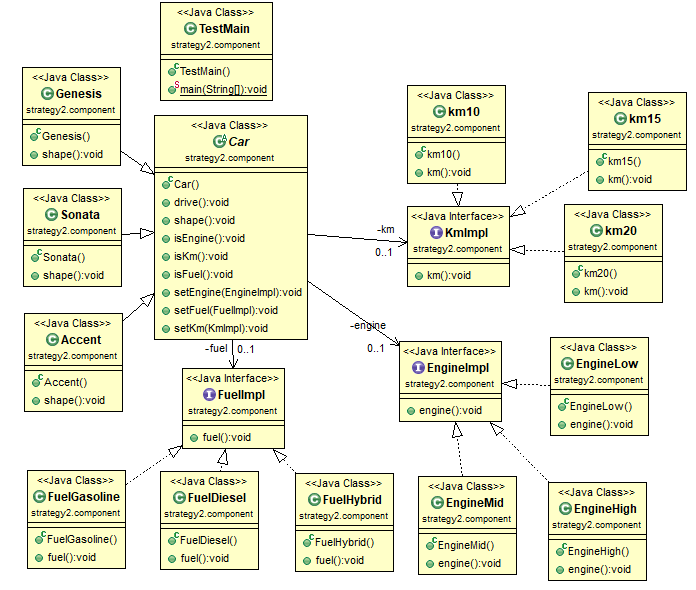

# 14.2 Strategy 패턴
[실습 소스 링크](https://github.com/jinrang2/TJS_BigData/tree/master/src/1_JAVA/ch14_pattern/src/strategy3/component)

패턴은 백문이불여일타!!!!

| 차종 | 엔진 | 연비 | 연료 |
| :--- | :--- | :--- | :--- |
| Genesis | EngineHigh | 10Km/L | 휘발유 |
| Sonata | EngineMid | 15Km/L | 휘발 |
| Accent | EngineLow | 20Km/L | 경유 |

새로운 연료인 하이드리드를 추가하는 변경사항이 발생시 연료 인터페이스를 상속하는 FuelHybrid 객체를 생성후 소나타의 연료만 변경시킴 

